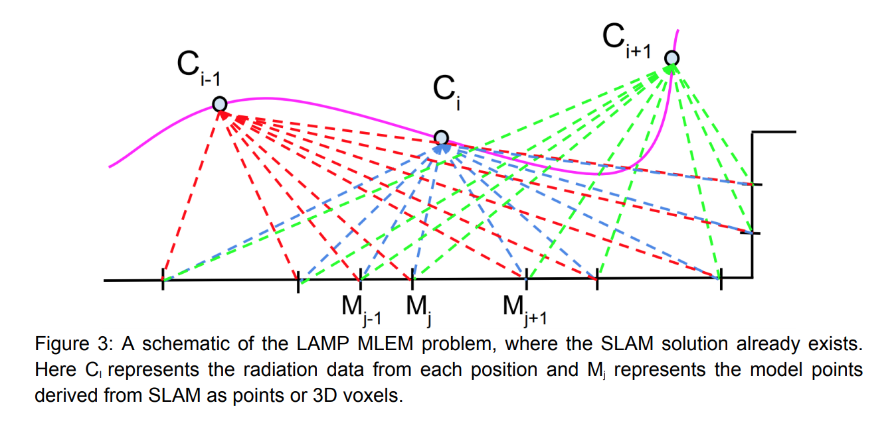
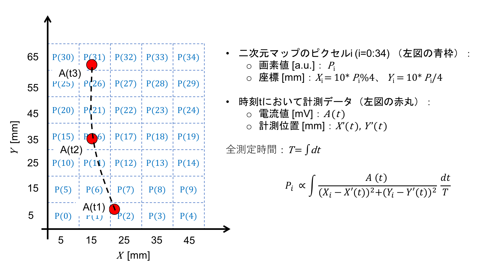
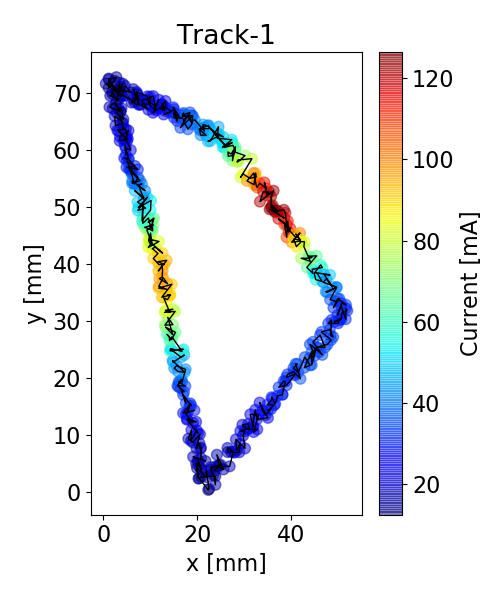
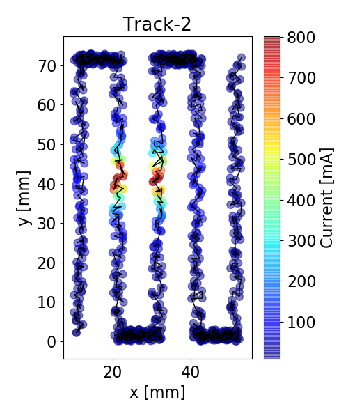
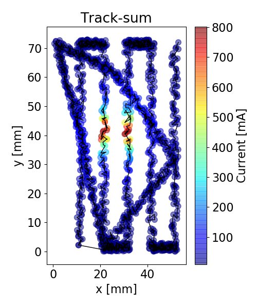
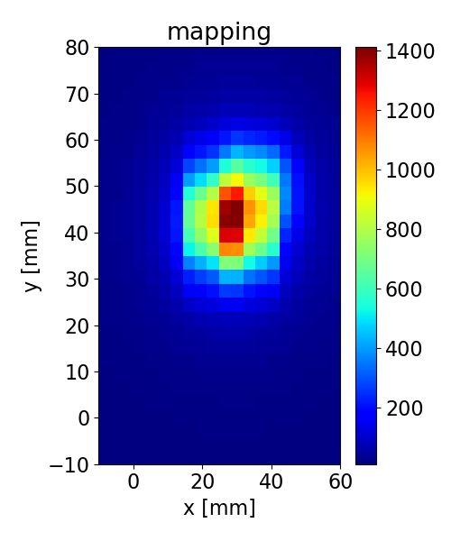

# imaging-isl
逆自乗法を利用したproximity imagingの再構成について

## 参考文献
- [1] [THE REFLECTOR PROBLEM AND THE INVERSE SQUARE LAW](https://www.math.temple.edu/~gutierre/papers/GutierrezSabraReflectorandinversesquarelaw_june_5_2013.pdf)

- [2] [3-D Radiation Mapping in Real-Time with the Localization and Mapping Platform LAMP
from Unmanned Aerial Systems and Man-Portable Configurations](https://arxiv.org/pdf/1901.05038.pdf)

## イメージング原理

引用[2] \(実際にはMLEMも適用している)

上の図を書き下した図（例)

## テストデータ

使用コード: mapping.py

### 検出器の移動1(data.txt)

### 検出器の移動2(data2.txt)

### 検出器の移動1+2

### 2次元マッピング

画像の平均フィルタ(5x5)適応済み: [参考URL](http://labs.eecs.tottori-u.ac.jp/sd/Member/oyamada/OpenCV/html/py_tutorials/py_imgproc/py_filtering/py_filtering.html)  
(そうでなければ、トラック部分が濃く出てしまい、スポット位置が収束しない)

